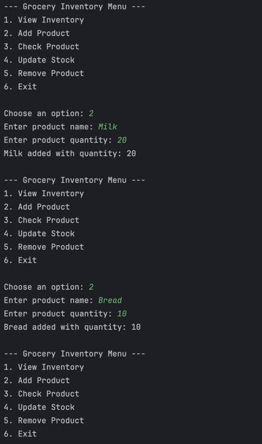
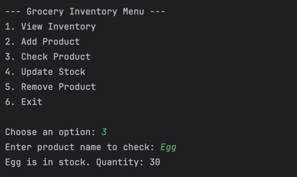
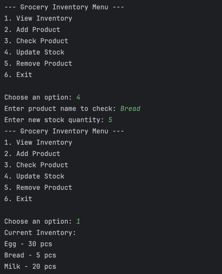
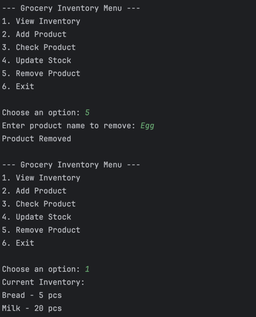
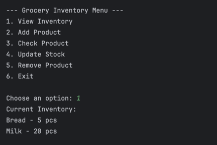
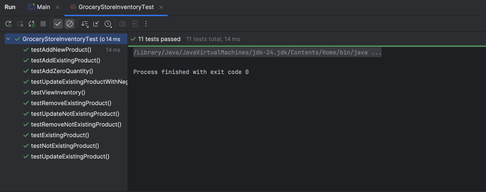
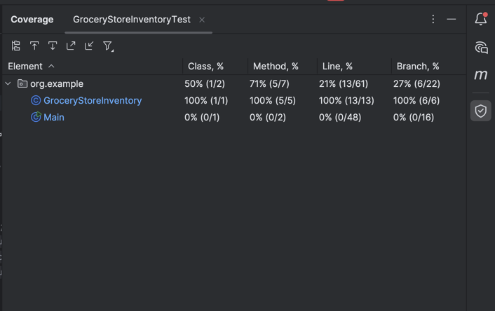

## Earl John Pulido
#### Lead, Cadet Engineer

## Grocery Store Inventory System
Use HashMap to manage a grocery store’s inventory, where each product has a name and a quantity in stock.

You are managing the inventory system of a small grocery store. You need to:
- Add products 
- Check if a product is available 
- Update stock when items are sold or restocked 
- Remove products that are no longer sold

## Sample Output

### Add Product

### Check Product

### Update Stock

### Remove Product

### View Products

## Sample Test Output

### Unit Test Output

## Unit Test Coverage

